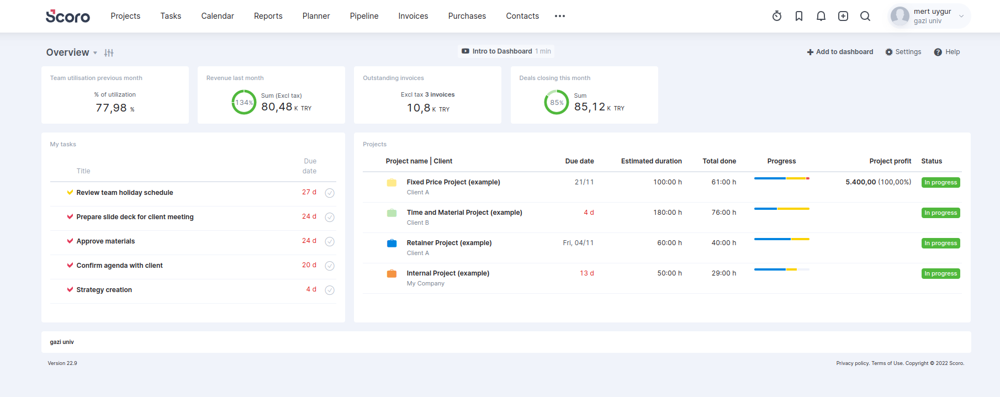
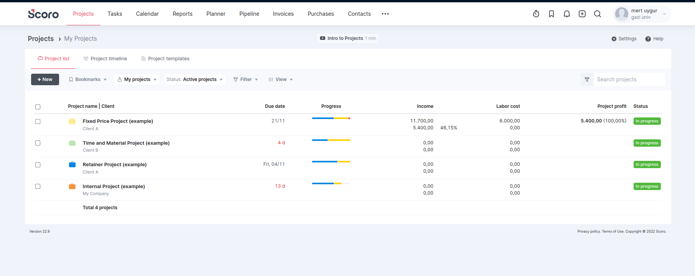
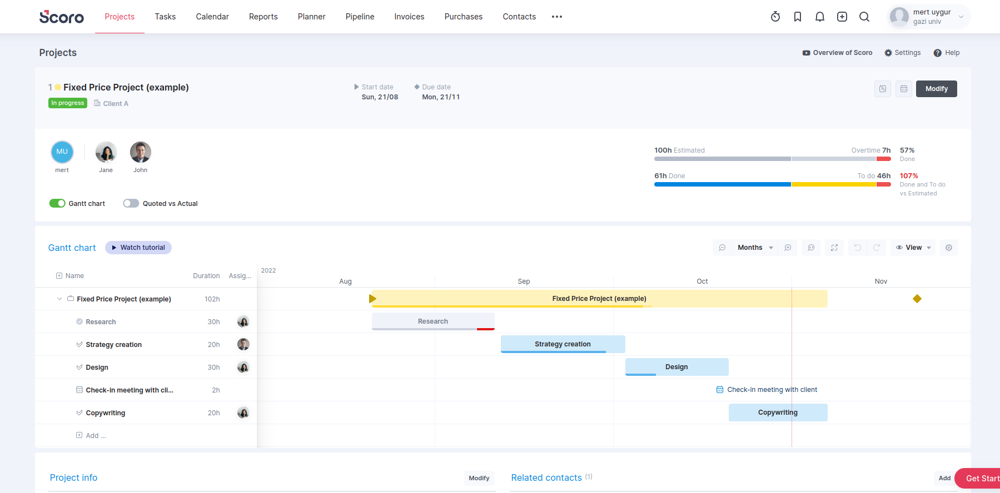
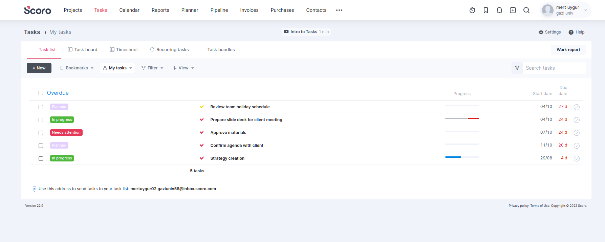

# Scoro

[Scoro](https://www.scoro.com/) is a End-to-End Work Management Software sytem.
This will probably be our first reference when we want to do something.

It has so many features including **Task Planning**, **Dashboard**, **Project Management**,and **Human Resource Management**.

The landing page has general information about all projects like statistics, tasks, and projects progression.

Team utilization has a nice feature of scoro, this might be where the artificial intelligence comes into the stage. Though we cannot know how scoro calculates the utilization, we may find our method to calculate the utilization.

Since this page belongs to a user, we can see the user's tasks and projects. In that case, user and admin dashboards will not be much different.

Information about the projects' displayed on that page must be selected carefully. Scoro asserts the *due date* of the project as the most important information. Also the tasks' progression is displayed a thin line that tells a lot of things. Completed tasks colored as blue, in progression tasks are displayed in yellow, and idle tasks are shown in red color.


The table in *Projects* page is not different than in the *Dashboard* page.

 Therefore the filter functionality appears in that page. Probably scoro ignored this feature on dashboard to make it seem more simple on the *Dashboard*, It is a nice move of them.

In a *Project* page, first thing to see is the members. Since the most important piece of information that a user wants to see of a project is the members, it is a good idea to put members section somewhere on the top of the page.

The other most important thing to notice on that page is the timeline. A project has a general timeline and every team in the project has its own timeline. This is a good idea to show the progress of the project. Also, the timeline is a good place to show the tasks' progressions.

*Tasks* page has a more simple layout than the other pages.

Obviously, the most important part is the progression of tasks in this page, and scoro does it well. Color choices could be different but it is still understandable. Scoro wanted to show as little information as possible on this page, and it is a good move to put forward the progressions.


Scoro has many features and UI/UX decisions to learn from. We will try to improve and implement some of them in our project.
<!-- 
Add **Markdown or React** files to `src/pages` to create a **standalone page**:

- `src/pages/index.js` → `localhost:3000/`
- `src/pages/foo.md` → `localhost:3000/foo`
- `src/pages/foo/bar.js` → `localhost:3000/foo/bar`

## Create your first React Page

Create a file at `src/pages/my-react-page.js`:

```jsx title="src/pages/my-react-page.js"
import React from 'react';
import Layout from '@theme/Layout';

export default function MyReactPage() {
  return (
    <Layout>
      <h1>My React page</h1>
      <p>This is a React page</p>
    </Layout>
  );
}
```

A new page is now available at [http://localhost:3000/my-react-page](http://localhost:3000/my-react-page).

## Create your first Markdown Page

Create a file at `src/pages/my-markdown-page.md`:

```mdx title="src/pages/my-markdown-page.md"
# My Markdown page

This is a Markdown page
```

A new page is now available at [http://localhost:3000/my-markdown-page](http://localhost:3000/my-markdown-page). -->
