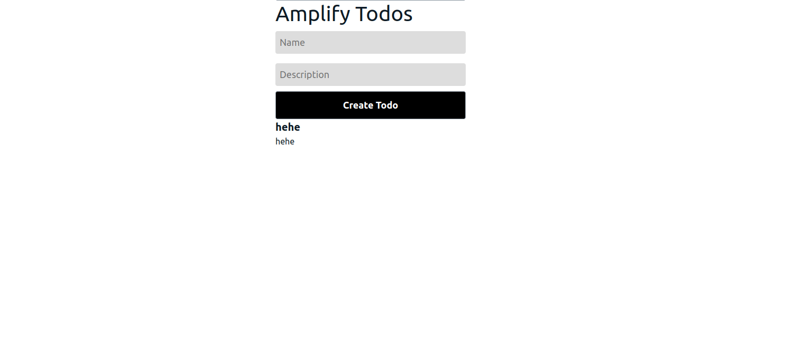
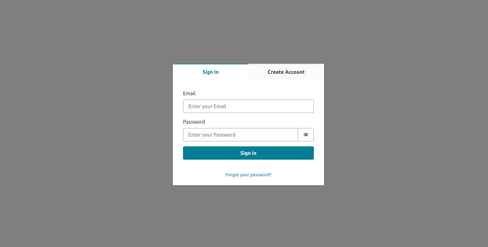
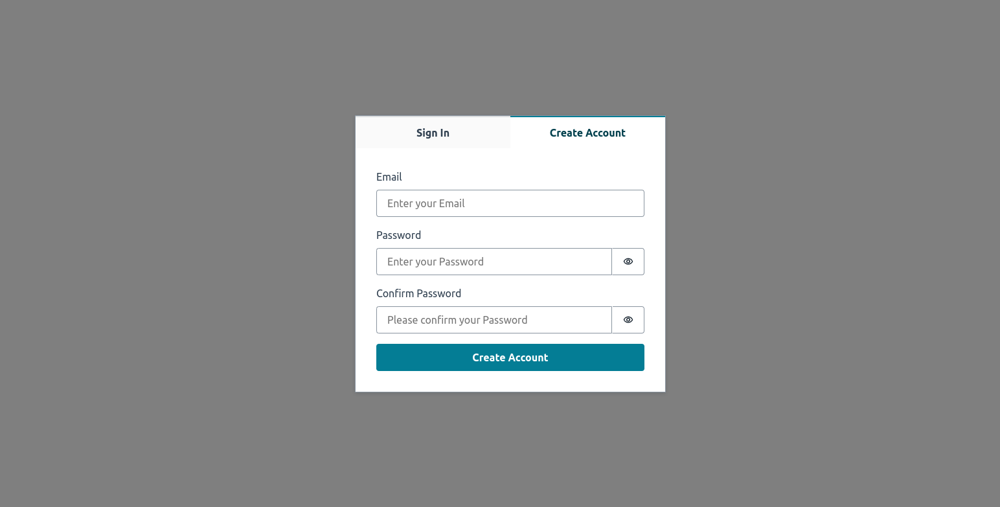
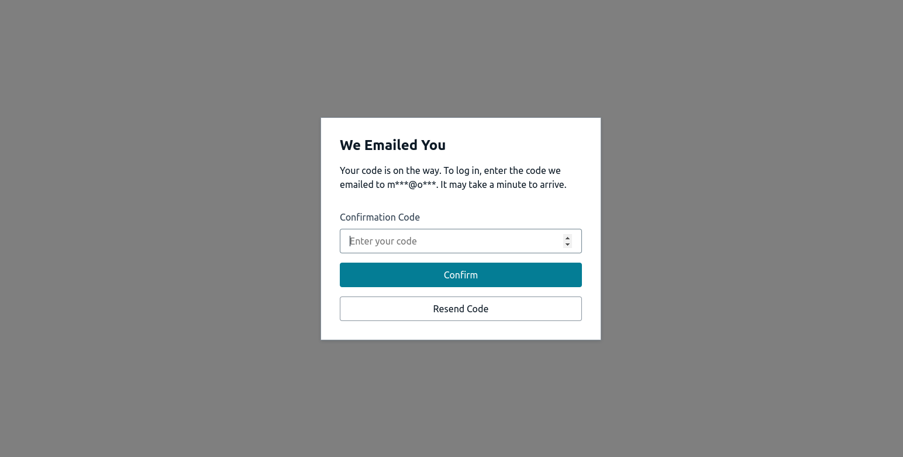
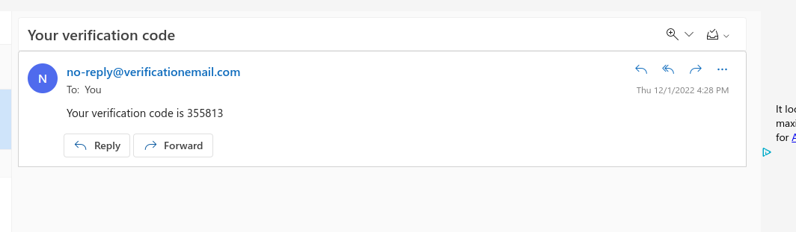
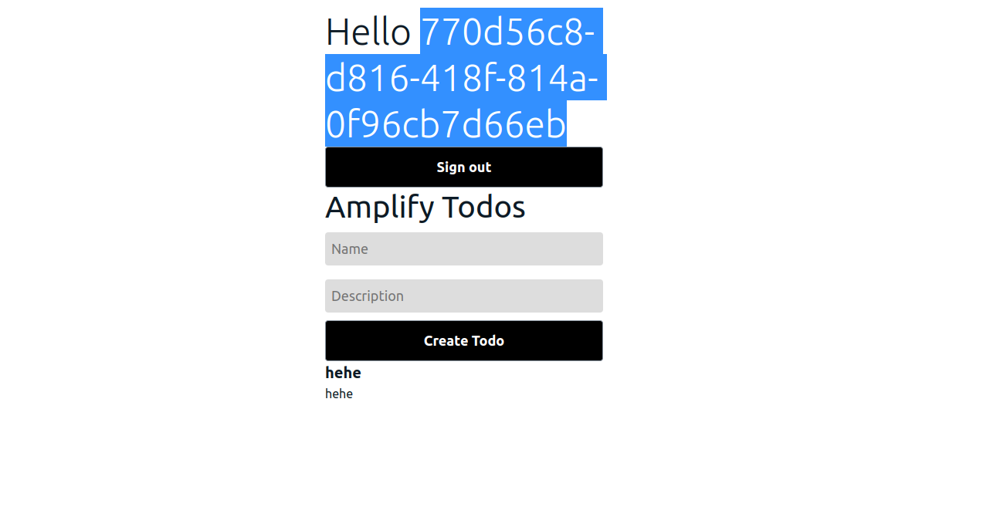

# Dec 1, 2022 - Authentication

This demo is made for experimenting authentication flow in the system. It is a simple application that allows you to login and logout. It also shows the current user's name and email.

First, we needed a react application. We used the create-react-app tool to create a new react application.


```js
npx create-react-app react-gp
```

After creating our react application. We need to install the amplify into our frontend application. We can do this by running the following command. A bunch of questions are asked in this step. We can just press enter to use the default values.

```bash
amplify init
```

Then the first library to interact with the aws is installed: *aws-amplify*.

In order to make use of this library, we need to configure it. We added the following lines to our main App.js file.

```js
import { Amplify } from 'aws-amplify';
import awsExports from './aws-exports';
Amplify.configure(awsExports);
```

After configuring the amplify, we need to install the *aws amplify api* to the application. We can do this by running the following command.

```bash
amplify add api
```
This api is the communication channel to AWS for our frontend react application. After installing this api to our application - it creates bunch of files on the file system - we need to push the changes to the AWS. We can do this by running the following command.

```bash
amplify push
```

Until now, we have created a frontend application and added a basic GraphQL API endpoint to communicate with. We are now able to add new TODOs, and able to see them on the page. It is made possible by the GraphQL API that AWS set up for us. It basically looks like this:



In order to add authentication to this application, we need to run the following command.

```bash
amplify add auth
```

This command will ask a bunch of questions. We can just press enter to use the default values. After this command, we need to push the changes to the AWS. We can do this by running the following command.

```bash
amplify push
```

After pushing the changes to the AWS, we need to install the *auth components* to the application. We can do this by running the following command.

```bash
npm install @aws-amplify/ui-react
```

This library includes the form components that we need to add authentication to our application. After installing this library, we need to add the following lines to our main App.js file.

```js
import { withAuthenticator, Button, Heading } from '@aws-amplify/ui-react';
import '@aws-amplify/ui-react/styles.css';
```

withAuthenticator component will help us determine if the page needs authentication or not. If the page needs authentication, it will show the login form. If the user is already logged in, it will show the page. We can use this component to wrap our App component. After wrapping the App component, we need to export the component with the withAuthenticator component. We can do this by adding the following line to our main App.js file.

```js
export default withAuthenticator(App);
```

And in order to know which user is signed in, we add parameters(props) to our main function, and show the user's information after login.

```js
/* src/App.js */
function App({ signOut, user }) { 
  // ... 
}
```

```js
<Heading level={1}>Hello {user.username}</Heading>
<Button onClick={signOut}>Sign out</Button>
```

After starting up our application, since we render this main App.js file and it need authentication, we are redirected to login page.



Since we have no account yet, we need to create a new account. We can do this by clicking on the *Create account* link.



After creating our account, an email is sent us to confirm the registration.



The mail sent:



After entering this code to the input field, the registration process is completed. After signing in the application, the following screen is shown.



The authentication flow is made basically. Of course there are fields that may change and may be different things to configure but this is the most basic authentication flow.